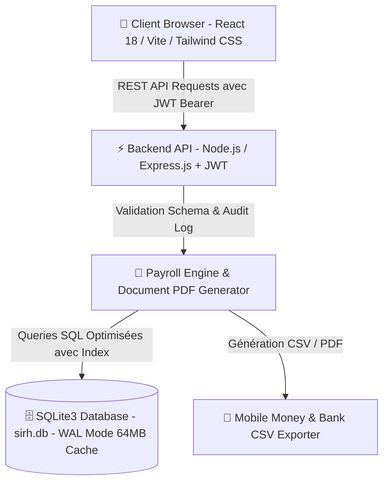

# 🇨🇮 SIRH Côte d'Ivoire (SIRH-CIV) — Solution SaaS Enterprise RH & Paie

[](LICENSE)
[](https://nodejs.org/)
[](https://react.dev/)
[](https://vitejs.dev/)
[](https://www.sqlite.org/)
[](https://www.cnps.ci)

**SIRH-CIV** est un Système d'Information des Ressources Humaines de nouvelle génération, **SaaS Multi-Tenant** et **100% conforme au Code du Travail de la République de Côte d'Ivoire** ainsi qu'aux réglementations fiscales de la **DGI** et de la **CNPS**.

Conçu pour les PME, grandes entreprises et cabinets de gestion RH opérant en Côte d'Ivoire et dans la zone UEMOA/OHADA, **SIRH-CIV** offre une expérience utilisateur haut de gamme, réactive et sécurisée pour gérer l'intégralité du cycle de vie des collaborateurs.

---

## 📋 Sommaire

- [✨ Fonctionnalités Principales](#-fonctionnalités-principales)
- [☁️ Adaptabilité & Multi-Tenancy SaaS](#️-adaptabilité--multi-tenancy-saas)
- [📜 Génération de Documents RH & Bulletins Officiels](#-génération-de-documents-rh--bulletins-officiels)
- [🧮 Moteur de Paie Ivoirien (DGI & CNPS 2026)](#-moteur-de-paie-ivoirien-dgi--cnps-2026)
- [📱 Exports Mobile Money & Virements Bancaires](#-exports-mobile-money--virements-bancaires)
- [🏛️ Architecture Technique](#️-architecture-technique)
- [📂 Structure du Projet](#-structure-du-projet)
- [💻 Installation & Démarrage](#-installation--démarrage)
- [🔨 Build & Déploiement en Production](#-build--déploiement-en-production)
- [🔑 Identifiants de Démo](#-identifiants-de-démo)
- [📄 Licence & Support](#-licence--support)

---

## ✨ Fonctionnalités Principales

- **👥 Dossiers Salariés & Fiches Individuelles** : Gestion complète des employés, historique des contrats (CDI, CDD, Stage), ayants droit, RIB/Mobile Money et organigramme hiérarchique direct.
- **📅 Gestion des Congés & Absences** : Demandes salariales, validation multi-niveaux, calcul automatique des droits légaux (2.2 jours/mois + majorations d'ancienneté).
- **💰 Gestion de la Paie & Avances** : Clôture mensuelle, déduction automatique des avances/prêts sur salaire approuvés, livre de paie et historiques.
- **🤖 Recrutement & Matching CV par IA** : Création d'offres d'emploi, suivi des candidatures, tri des compétences par IA et tests d'évaluation en ligne chronométrés (QCM).
- **📊 Pointerie & Présences** : Suivi des heures effectives (base 173.33 h/mois), retards et heures supplémentaires.
- **🎓 Formations & Évaluations** : Planification des plans de formation et fiches d'évaluations annuelles de performance.
- **🛡️ Espace Libre-Service Salarié & Sécurité** : Portail collaborateur isolé et traçabilité intégrale via un journal d'audit (Audit Logs).

---

## ☁️ Adaptabilité & Multi-Tenancy SaaS

SIRH-CIV est conçu dès l'origine comme une plateforme SaaS hautement personnalisable :

1. **Branding & Charte Visuelle Client** :
   - Importation du logo officiel de l'entreprise (PNG/JPG/SVG) avec affichage automatique sur tous les documents.
   - Sélecteur de couleurs primaire et secondaire (Hex + Thèmes prédéfinis).
   - Gestion des sous-domaines / alias client (ex: `acme.sirh-civ.ci`).
2. **Formules d'Abonnement & Licensing** :
   - Quotas de salariés ajustables avec jauge de consommation en temps réel (`STARTER`, `BUSINESS PRO`, `ENTERPRISE`).
   - Interrupteurs d'activation modulaire (Paie, Congés, Évaluations, Recrutement, Portail Salarié, Mobile Money).
3. **Multi-Juridiction & Multi-Pays** :
   - Prise en charge de la réglementation RH de Côte d'Ivoire 🇨🇮, Sénégal 🇸🇳, Cameroun 🇨🇲, Gabon 🇬🇦, Togo 🇹🇬, Bénin 🇧🇯, Burkina Faso 🇧🇫, Mali 🇲🇱, France 🇫🇷.
   - Devise paramétrable (FCFA XOF, FCFA XAF, EUR, USD, GNF).

---

## 📜 Génération de Documents RH & Bulletins Officiels

La plateforme intègre un générateur HTML/PDF haute résolution pour tous les actes administratifs :

- **Bulletin de Paie Officiel (CCN Côte d'Ivoire)** :
  - Modèle conforme comprenant le badge vert `BULLETIN DE PAIE`, les spécifications administratives (Matricule, Niveau, Coefficient, Indice, Ancienneté, N° CNPS, Horaire 173.33h), le suivi des congés et les 7 colonnes de rubriques (Gain, Retenue Salariale, Taux & Charges Patronales).
  - Conversion automatique du salaire Net à payer en **toutes lettres en Français** (ex: *Cinq cent mille FRANC CFA*).
  - Présence garantie du logo d'entreprise et des blocs de signature réglementaires.
- **Contrats de Travail Sur Mesure** : Modèles CDI, CDD et Stage intégrant les articles du Code du Travail ivoirien (Essai Art. 14.2, précarité 3%, préavis Art. 16.8).
- **Attestations RH & Actes Disciplinaires** : Attestation de travail (avec logo, sans QR code selon directive), certificat de travail, lettres d'avertissement et demandes d'explications écrites.
- **Fiche Individuelle Collaborateur** : Carte d'identité RH complète avec photo/avatar, organigramme, calcul d'ancienneté effectif et QR Code de vérification.

---

## 🧮 Moteur de Paie Ivoirien (DGI & CNPS 2026)

Le moteur de calcul (`payrollCalc.js`) intègre de manière stricte les barèmes légaux :

| Cotisation / Impôt | Taux Salarial | Taux Patronal | Assiette / Plafond |
|---|---|---|---|
| **ITS (Impôt Salarial DGI)** | Barème progressif | - | Brut Imposable |
| **ITS Patronal (Nationaux)** | - | **1.20%** | Brut Imposable |
| **ITS Patronal (Expatriés)** | - | **12.00%** | Brut Imposable |
| **CNPS Retraite Régime Général** | **6.30%** | **7.70%** | Plafond 3 375 000 FCFA |
| **CNPS Prestations Familiales (PF)**| - | **5.75%** | Plafond 70 000 FCFA |
| **CNPS Assurance Maternité** | **0.00%** | **0.75%** | Plafond 70 000 FCFA |
| **CNPS Accident du Travail (AT)** | - | **3.00%** | Plafond 70 000 FCFA |
| **Taxe d'Apprentissage (TA)** | - | **0.40%** | Brut Imposable |
| **Taxe FDFP (Formation)** | - | **0.60%** | Brut Imposable |
| **CMU (Couverture Maladie)** | **500 FCFA** | **500 FCFA** | Forfait mensuel |
| **SMIC Minimum Légal** | - | - | **75 000 FCFA** |
| **Exonération Transport** | Exonéré | Exonéré | Jusqu'à **30 000 FCFA** |

---

## 📱 Exports Mobile Money & Virements Bancaires

SIRH-CIV facilite la paie bancarisée et digitale en Côte d'Ivoire et dans la sous-région :
- Génération en 1 clic de fichiers CSV préformatés pour le paiement de masse via **Wave, Orange Money, MTN Mobile Money et Moov Money**.
- Exportation des ordres de virement bancaire au format norma SICA-UEMOA.

---

## 🏛️ Architecture Technique



### Stack Technologique
- **Frontend** : React 18, Vite 5, Tailwind CSS, Lucide Icons, Framer Motion, Axios.
- **Backend** : Node.js, Express.js, SQLite3 (`sirh.db`), JSON Web Token (JWT), bcrypt.
- **Optimisation BDD** : Mode SQLite WAL (Write-Ahead Logging), cache RAM de 64 Mo, indexation sur matricules, statuts et timestamps.

---

## 📂 Structure du Projet

```
SIRH-CIV/
├── backend/
│   ├── database.js          # Schéma SQLite, migrations dynamiques & seed initial
│   ├── server.js            # API REST Express, middlewares JWT, Audit Log & endpoints
│   ├── package.json         # Dépendances backend Node.js
│   └── sirh.db              # Base de données SQLite3
├── frontend/
│   ├── src/
│   │   ├── components/      # Composants UI réutilisables (PageHeader, Modal, etc.)
│   │   ├── context/         # DataContext React pour l'état global
│   │   ├── pages/           # Pages (Dashboard, Employees, Payroll, Settings, etc.)
│   │   ├── utils/           # payrollCalc.js (Calculs) & documentGenerator.js (PDF/HTML)
│   │   ├── App.jsx          # Routage React Router DOM v6
│   │   └── main.jsx         # Point d'entrée React
│   ├── public/              # Logos et favicons
│   ├── index.html           # Template HTML Vite
│   ├── package.json         # Dépendances frontend
│   └── vite.config.js       # Configuration du bundler Vite
└── README.md                # Documentation principale
```

---

## 💻 Installation & Démarrage

### 1. Prérequis
- [Node.js](https://nodejs.org/) (version 18.0.0 ou supérieure)
- [npm](https://www.npmjs.com/) (version 9.0.0 ou supérieure)

### 2. Cloner le Dépôt
```bash
git clone https://github.com/VOTRE_ORGANISATION/SIRH-CIV.git
cd SIRH-CIV
```

### 3. Installer les Dépendances

**Backend :**
```bash
cd backend
npm install
```

**Frontend :**
```bash
cd ../frontend
npm install
```

### 4. Démarrer en Mode Développement

**Lancer le backend (Port 5000) :**
```bash
cd backend
npm start
```

**Lancer le frontend (Port 5173) :**
```bash
cd frontend
npm run dev
```

Accédez à l'application dans votre navigateur : `http://localhost:5173`.

---

## 🔨 Build & Déploiement en Production

Pour compiler le frontend pour la production :

```bash
cd frontend
npm run build
```

Le build est généré dans `frontend/dist`. Le serveur Node.js backend (`server.js`) sert automatiquement ces fichiers statiques en environnement de production.

Pour vérifier la syntaxe et tester le build :
```bash
# Vérification du backend
cd backend
node --check server.js

# Build du frontend
cd ../frontend
npm run build
```

---

## 🔑 Identifiants de Démo

| Rôle | Identifiant / Email | Mot de passe |
|---|---|---|
| **Administrateur RH / SaaS Admin** | `admin@sirh.ci` | `admin123` |
| **Gestionnaire RH** | `rh@sirh.ci` | `rh123456` |
| **Espace Employé** | `EMP-001` (Kouamé Jean-Baptiste) | `employe123` |

---

## 📄 Licence & Support

Ce projet est distribué sous licence **ISC**.

Pour toute demande d'assistance technique ou de déploiement d'une instance SaaS dédiée, veuillez contacter la Direction Technique à **contact@entreprise.ci**.

---
*© 2026 SIRH-CIV — Solution d'Excellence RH & Paie pour la Côte d'Ivoire et l'Afrique de l'Ouest.*
"# Gebat_RH" 
